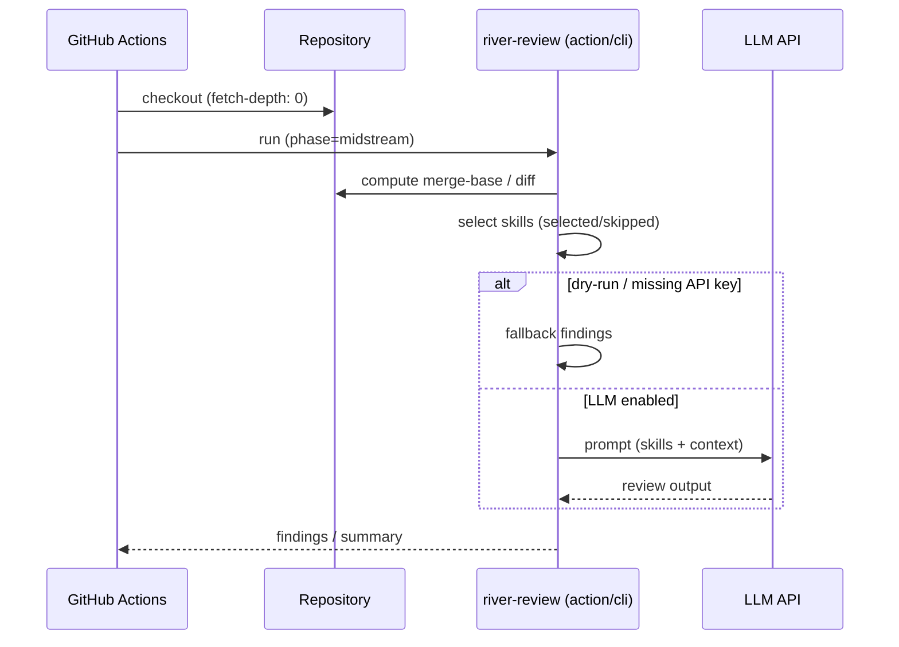
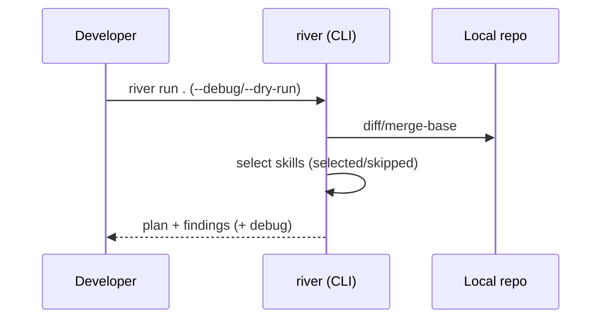

# The River Architecture

River Review flows with your development process.

Conceptually, the flow has three major segments (see [Upstream / Midstream / Downstream phases](./upstream-midstream-downstream.md)):

- **Upstream**: requirements, architecture, ADR, design
- **Midstream**: implementation, refactoring, CI integration
- **Downstream**: QA, test analysis, release checks

A fourth layer -- [**Riverbed Memory**](./riverbed-memory.md) -- stores contextual decisions so that subsequent reviews can reuse them.

River Review is a **context engineering framework**. It systematically selects, filters, and assembles context—skills, diffs, and memory—to maximize review quality within a bounded context window. Progressive disclosure ensures that only the necessary level of detail is loaded at each stage, preventing attention dilution.

## Components

```mermaid
flowchart LR
  Diff[Git diff / PR diff] --> Optimizer[Diff optimizer]
  Optimizer --> Loader[Skill loader]
  Loader --> Filter{phase/applyTo\ninputContext/dependencies}
  Filter -->|selected| Planner[Skill planner\n(optional)]
  Filter -->|skipped + reasons| Skipped[Skipped list]
  Planner --> Runner[Review runner]
  Runner --> Output[Output schema\nfindings[] + summary]
```

## Review Team (parallel perspective-based reviewers)

Beyond a single general-purpose review, the review runner provides **parallel orchestration of perspective-based reviewer roles**, implemented in `src/lib/reviewer-orchestrator.mjs`.

- **Roles**: bug-hunter / security-scanner / test-gap / dependency-reviewer / frontend-reviewer / ci-cd-reviewer, each treated as an independent reviewer.
- **Automatic selection**: with `--reviewers auto`, `selectRolesAuto` picks roles from the diff content and risk signals. To select explicitly, pass a comma-separated list such as `--reviewers bug-hunter,security-scanner`.
- **Parallel fan-out**: role × chunk pairs run in parallel via `Promise.allSettled`, so a failure in one role does not discard the results of the others.
- **Merge**: findings from each role are grouped via connected-components, and `mergeFindings` consolidates duplicate or adjacent findings.

This is a single orchestrator running perspective-based roles in parallel and merging the results, not a swarm of autonomous agents. Each role only produces review material; it has no authority to decide or approve.

```mermaid
flowchart LR
  Diff[Diff + chunks] --> Select[selectRolesAuto\n--reviewers auto]
  Select --> R1[bug-hunter]
  Select --> R2[security-scanner]
  Select --> R3[test-gap / dependency /\nfrontend / ci-cd]
  R1 --> Merge[mergeFindings\nconnected-components]
  R2 --> Merge
  R3 --> Merge
  Merge --> Findings[findings[] + summary]
```

## Execution Strategy versus Review Team

The Host/Harness may choose a Single / Cascade / Critique execution strategy for producing a candidate. River Review's Review Team instead selects and coordinates review perspectives. These are different routing responsibilities. See [Execution Strategy and Orchestration Guardrails](./execution-strategy.md) for the proposed accounting contract and the five guardrails.

## Agent layer (generate → review → revise loop)

River Review can be embedded as the **review stage** of a generating agent's **generate → review → revise** loop (Epic #1150).

- River Review acts as a **critic** that returns findings / verdict / `suggestedLoopSignal`.
- Deciding whether to iterate, stop, or escalate is the **caller's responsibility** (the calling agent). River Review does not run the loop itself; it only returns material for the decision.
- Findings and verdict are decision material, not auto-approval. Under risk-tiered human supervision, the cliff preserves the human-approval boundary (HITL).

For the contract and reference implementation, see:

- Contract: [Loop Convergence Contract](../reference/loop-convergence-contract.en.md)
- Reference implementation: `examples/loop-reference-agent/` (a minimal loop that satisfies the contract)

## Representative flow (GitHub Actions)



## Representative flow (local)



## CLI-first execution surface and resolution order

The **canonical execution surface of River Review is the CLI**. GitHub Action / Claude Code command / Codex skill / MCP / shell are designed as thin wrappers that call this CLI (e.g. the GitHub Action is a thin adapter: `runners/github-action/src/index.mjs` merely imports `src/cli.mjs`). Review judgement, skill resolution, and gate decisions live in the CLI, not in each surface.

- **Command name**: both `river` and `river-review` bins point to `src/cli.mjs`. In agent-facing docs and examples, prefer `river-review` to avoid ambiguity.
- **Subcommands**: `river-review run <path>` (local diff review), `river-review review plan|exec|verify` (artifact-driven gate), `river-review skills <subcommand>`.
- **JSON is the first-class output**: the Review Artifact conforming to `schemas/review-artifact.schema.json` (`version: "1"`) is the machine-readable contract. PR inline comments / Checks / Markdown summary / dashboard / agent handoff are adapters that transform this JSON (`--output markdown` is a human-facing derived view).

### skill / gate / config resolution order

Which skills / gates / rules are ultimately selected is resolved deterministically and can be inspected via `--debug` output (`plan.selectedSkills` / `skippedSkills` with reasons). Precedence (highest first):

1. **CLI explicit options** — `--skill-set` / `--context` / `--dependency`, etc. (the config file is auto-detected from the repo root, not via a `--config` flag; see below)
2. **Repository local** — `.river-review.{json,yaml,yml}` (`src/config/loader.mjs`), `.river/rules.md` + `.river/rules.d/*.md`, `skills/registry.yaml`
3. **User global** — `~/.river-review/config.{json,yaml,yml}` (`src/config/loader.mjs`). Always applies as a user-wide base. When a repository-local config exists, it is merged on top of the global one (repository-local wins). On CI or shared hosts where a stray global config must not silently change review behavior, set `RIVER_REVIEW_DISABLE_GLOBAL_CONFIG=1` to disable this tier.
4. **Built-in** — bundled skills and defaults

### No auto-update

The CLI / Action ship no auto-update mechanism. Consumers pin and update versions explicitly (GitHub Action version pinning, npm lockfiles). This is a deliberate choice favoring deterministic execution and auditability.

See also: gate responsibilities in [Review Gates Design](https://github.com/s977043/river-review/blob/main/docs/development/review-gates-design.md) (in-repo dev doc), and config options in [config-schema](../reference/config-schema.en.md).
