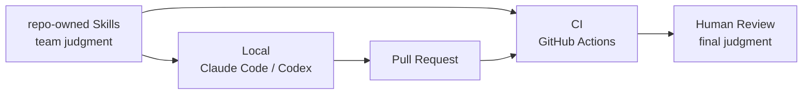

# River Review

**Turn review into an organizational judgment asset.**

River Review is an OSS framework that codifies review standards as **versioned, repo-owned Skills** and applies the same team judgment from local Claude Code / Codex reviews through post-PR GitHub Actions checks.

## River Review in 30 seconds



**Remove noise locally before the PR, then re-check the PR with shared team standards.**  
AI produces findings and decision inputs; the caller or a human keeps ownership of GO / NO-GO and final approval.

| Goal | Fastest path |
| --- | --- |
| Try River Review in five minutes | [Quickstart](/guides/quickstart.en) |
| Start from reusable review knowledge | [Starter Cookbook](/guides/starter-cookbook.en) |
| Run the pre-PR + post-PR two-stage pattern | [Two-stage review gate](/guides/two-stage-review-gate.en) |
| Compare with other AI review tools | [AI code review comparison](/comparison/ai-code-review-tools.en) |
| Measure quality, regressions, and cost | [Run store / regression](/guides/track-runs-and-regressions.en) / [Cost estimation](/guides/cost-estimation.en) / [Dashboard](/dashboard) |

## Fastest trial

### Claude Code

```text
/plugin marketplace add s977043/river-review
/plugin install river-review@river-review-marketplace
/reload-plugins
/river-review:review-local
```

Normal plugin usage needs **no additional River Review LLM API key**. Claude Code's own model applies the Skills.

### Codex

```text
codex plugin marketplace add s977043/river-review
```

After adding the marketplace, River Review's specialist review skills are available to Codex. See the [Quickstart](/guides/quickstart.en) for the full path.

## What changes in practice

A generic instruction such as "check error handling" can produce vague advice and leave the team to re-decide what matters. A River Review Skill carries **scope, evidence expectations, severity, and false-positive avoidance rules**.

| Generic review instruction | River Review Skill |
| --- | --- |
| "Improve error handling." | `logging-observability` points to the changed location and returns a finding about swallowed errors, observability impact, and a concrete fix |
| The review lens can drift from run to run | fixture + golden output tests pin expected behavior and regression evals verify changes |
| Low-value findings can repeat | confidence / severity / suppression memory / review coverage control noise |

See [Representative Skills](/guides/representative-skills.en) for real fixtures and expected outputs.

## Quality and operational capabilities available after adoption

River Review already provides the following foundations for team use:

- **Skill quality**: fixture + golden output tests, regression evals, and per-skill false-positive evaluation.
- **Noise control**: severity (critical / major / minor / info), confidence, suppression memory, and review coverage.
- **Multi-review synthesis**: consensus, Team Lead synthesis, and blind-spot reporting.
- **Operational measurement**: Run store, regression comparison, usage telemetry, cost estimation, and dashboard views.
- **Adoption evidence**: competitive comparison, known limitations, and FAQ.

Start with existing Skills and measurement. Codify new team-specific judgment only after real usage shows a gap.

## Understand the concept

- [Concept: turning review into an organizational judgment asset](./explanation/concept.en.md)
- [Welcome to River Review](./explanation/intro.en.md)
- [What is River Review](./explanation/what-is-river-review.en.md)
- [Human Judgment Focus](./explanation/human-judgment-focus.en.md)

## Documentation structure

The official docs follow [Diátaxis](https://diataxis.fr/).

- **Tutorials**: step-by-step first success.
- **Guides**: task-oriented procedures.
- **Reference**: CLI, schemas, and output contracts.
- **Explanation**: concepts and design decisions.

Japanese is the source of truth, with English companions in corresponding `.en.md` files. [日本語版はこちら](/).
