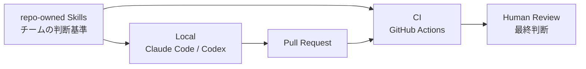

# River Review

**レビューを、組織の判断資産へ。**

River Review は、AI 支援開発のレビュー基準を **versioned / repo-owned な Skill** としてコード化し、Claude Code / Codex のローカルレビューから GitHub Actions の PR 後レビューまで同じ判断基準を使う OSS フレームワークです。

## 30 秒でわかる River Review



**PR 前にローカルでノイズを落とし、PR 後にチーム共通の基準で再確認する。**  
AI は findings と判断材料を出し、GO / NO-GO や最終承認は人間・呼び出し側が担います。

| 目的 | 最短ルート |
| --- | --- |
| まず 5 分で試したい | [クイックスタート](/guides/quickstart) |
| 既存のレビュー観点から始めたい | [Starter Cookbook](/guides/starter-cookbook) |
| PR 前 + PR 後の 2 段構えで運用したい | [2 段構えレビューゲート](/guides/two-stage-review-gate) |
| 他の AI レビューツールと比較したい | [AI コードレビュー比較](/comparison/ai-code-review-tools) |
| 品質・回帰・コストを測りたい | [Run store / 回帰比較](/guides/track-runs-and-regressions) / [コスト見積もり](/guides/cost-estimation) / [ダッシュボード](/dashboard) |

## 最速で試す

### Claude Code

```text
/plugin marketplace add s977043/river-review
/plugin install river-review@river-review-marketplace
/reload-plugins
/river-review:review-local
```

通常のプラグイン利用では **River Review 用の追加 LLM API キーは不要**です。Claude Code 自身のモデルが Skill を適用します。

### Codex

```text
codex plugin marketplace add s977043/river-review
```

マーケットプレイス追加後、River Review の専門 review skill を Codex から利用できます。詳細は [クイックスタート](/guides/quickstart) を参照してください。

## River Review がすでに提供しているもの

Gemini など外部レビューでよく挙がる「Eval」「ノイズ抑制」「比較」「コスト」「メトリクス」は、ゼロから追加する必要はありません。River Review には既に次の土台があります。

- **Skill の品質維持**: fixture + golden output、回帰 Eval、per-skill false-positive 評価。
- **ノイズ抑制**: severity（critical / major / minor / info）、confidence、suppression memory、review coverage。
- **複数レビューの整理**: consensus、Team Lead synthesis、blind spots。
- **運用計測**: Run store、回帰比較、usage telemetry、コスト見積もり、ダッシュボード。
- **導入判断**: 競合比較、既知の制限、FAQ。

次に必要なのは「機能を増やすこと」より、これらを **見つけやすく、最小構成で試しやすくすること**です。

## コンセプトを理解する

- [コンセプト（レビューを、組織の判断資産へ）](./explanation/concept.md)
- [River Review へようこそ](./explanation/intro.md)
- [River Review とは](./explanation/what-is-river-review.md)
- [Human Judgment Focus](./explanation/human-judgment-focus.md)

## ドキュメントの構成

River Review の公式ドキュメントは [Diátaxis](https://diataxis.fr/) に沿って整理しています。

- **Tutorials**: 最初の成功体験を作るステップバイステップ。
- **Guides**: 特定のゴールを達成するための手順。
- **Reference**: CLI / Schema / Output contract などの仕様。
- **Explanation**: 背景・設計判断・概念。

日本語をソース・オブ・トゥルースとし、英語版は対応する `.en.md` で管理します。[English docs](/index-en) も利用できます。
